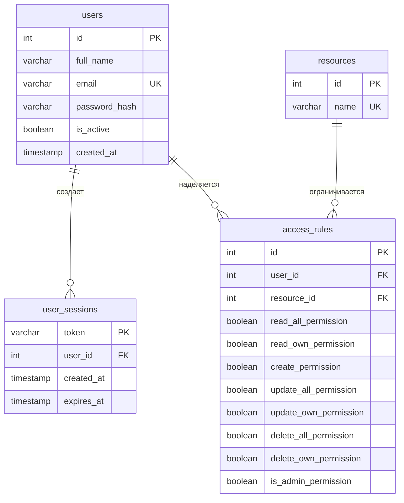

## 🛡️ Схема структуры управления ограничениями доступа (RBAC/ABAC)

В данном проекте реализована гибридная модель разграничения прав доступа, сочетающая элементы **RBAC** (Role-Based Access Control — управление доступом на основе ролей/матрицы прав) и **ABAC** (Attribute-Based Access Control — управление доступом на основе атрибутов объектов, в данном случае — авторства `owner_id`).

### 1. Архитектурный принцип изоляции
Система полностью изолирована от фреймворка и не использует стандартные механизмы Django `contrib.auth`. Вместо жесткого присвоения текстовых ролей (например, `"строка 'manager'"`), права пользователя динамически вычисляются на основе атомарных логических флагов (`bool`) в таблице `access_rules` для каждого типа ресурса индивидуально.

### 2. Матрица прав доступа (Уровень таблиц БД)
Основным ядром системы ограничений является таблица `access_rules`. Она представляет собой плоскую матрицу разрешений со следующей логикой разделения прав:

*   `is_admin_permission` (Глобальный флаг): При значении `true` полностью отключает дальнейшие проверки для данного ресурса. Пользователь получает абсолютные права на любые действия (симуляция роли Суперадминистратора).
*   `_all_permission` (Глобальное действие): Разрешает или запрещает совершать операцию над **любыми** объектами в системе (например, читать или обновлять чужие документы).
*   `_own_permission` (Контекстное действие): Разрешает совершать операцию **строго над теми объектами, которые принадлежат пользователю** (где `obj.owner_id == request.user.id`).

### 3. Двухуровневый алгоритм проверки прав (Инспекция запроса)

Входящий HTTP-запрос проходит два последовательных рубежа проверки в кастомном классе `CustomRBACPermission`:

#### 📊 Уровень 1: Глобальная проверка (`has_permission`)
Вызывается в самом начале запроса для анализа HTTP-метода и типа ресурса:
1. Система определяет системное имя ресурса из метаданных контроллера (например, `view.resource_name = 'document'`).
2. Из PostgreSQL извлекается строка правил для текущего `user_id` и `resource_id`. Если запись отсутствует — доступ прерывается со статусом **403 Forbidden**.
3. Происходит маппинг HTTP-метода на флаги прав:
   * **`GET` (список)** $\rightarrow$ Требует `read_all_permission == true` ИЛИ `read_own_permission == true`.
   * **`POST` (создание)** $\rightarrow$ Требует `create_permission == true`.
   * **`PUT/PATCH` (изменение)** $\rightarrow$ Требует `update_all_permission == true` ИЛИ `update_own_permission == true`.
   * **`DELETE` (удаление)** $\rightarrow$ Требует `delete_all_permission == true` ИЛИ `delete_own_permission == true`.
4. Если ни один из требуемых флагов для текущего метода не равен `true`, система возвращает ошибку **403 Forbidden**.

#### 🎯 Уровень 2: Объектная проверка (`has_object_permission`)
Вызывается автоматически, когда запрос направлен на конкретный ID объекта (`GET/PUT/DELETE /api/documents/<id>/`):
1. Если у пользователя активен глобальный флаг (например, `update_all_permission = true`), операция одобряется мгновенно.
2. Если глобальный флаг равен `false`, но активен контекстный флаг (например, `update_own_permission = true`), запускается ABAC-логика:
   * Система извлекает объект из бизнес-логики и считывает атрибут `obj.owner_id`.
   * Происходит строгое сравнение: `if obj.owner_id == request.user.id`.
   * При совпадении (пользователь является автором) — действие разрешается.
   * При несовпадении (пользователь пытается изменить чужой объект) — генерируется ошибка **403 Forbidden**.

### 4. Реализация на примере тестовых сценариев ТЗ

Данная схема наглядно демонстрирует выполнение требований ТЗ на заложенных тестовых данных:

1. **Сценарий Администратора:** Имеет `is_admin_permission = true` на ресурсы `document` и `access_rules`. Может беспрепятственно читать и изменять любые документы, а также имеет эксклюзивный доступ к `POST/GET /api/admin/rules/` для перенастройки матрицы прав.
2. **Сценарий Менеджера:** Имеет `read_all_permission = true`, `update_own_permission = true`, но `update_all_permission = false`. 
   * При запросе общего списка `GET /api/documents/` — глобальная проверка пропускает его, и он видит документы.
   * При попытке выполнить `PUT /api/documents/2/` (свой документ) — объектная проверка видит совпадение `owner_id` и одобряет запрос (**200 OK**).
   * При попытке выполнить `PUT /api/documents/1/` (чужой документ Администратора) — объектная проверка фиксирует нарушение владения и возвращает строгую ошибку **403 Forbidden**.


## 🗄️ 1. Архитектура и Схема Базы Данных

Вместо жестких ролей используется динамическая матрица прав доступа. Наличие суффиксов `_all_permission` и `_own_permission` позволяет гибко разделять доступ к глобальным данным и к объектам, созданным самим пользователем (`owner_id`).

### Архитектура БД



### Описание таблиц
1. **`users`** — Учетные данные (ФИО, уникальный email, хэш пароля PBKDF2, флаг активности `is_active`).
2. **`user_sessions`** — Механизм Token-аутентификации. Хранит UUID-токены и время их жизни (`expires_at`).
3. **`resources`** — Справочник сущностей, к которым накладываются ограничения (`document`, `access_rules`).
4. **`access_rules`** — Таблица связи Пользователь-Ресурс с набором `bool`-флагов на CRUD-действия.

---

## 👥 2. Предопределенные Тестовые Пользователи

В базу данных заложены два тестовых аккаунта для демонстрации работы всех сценариев ТЗ:

| Пользователь | Email | Пароль | Права доступа в системе |
| :--- | :--- | :--- | :--- |
| **Главный Администратор** | `admin@test.com` | `admin123` | Полный доступ к любым объектам и управление матрицей прав для других пользователей (`is_admin_permission = true`). |
| **Менеджер Петр** | `manager@test.com` | `manager123` | Не может читать общий список (`read_all`). Может создавать новые документы, но редактировать и удалять — **строго только свои** объекты (`_own_permission = true`). |

---

## 🚀 3. Инструкция по Развертыванию и Запуску

### Шаг 1. Окружение и зависимости
Убедитесь, что у вас установлен Python 3.10+ и запущен сервер PostgreSQL. Склонируйте проект и выполните в терминале:

```bash
# Создание и активация виртуального окружения
python -m venv .venv
source .venv/bin/activate  # Для macOS/Linux
.venv\Scripts\activate.ps1 # Для Windows (PowerShell)

# Установка пакетов
pip install -r requirements.txt
```

### Шаг 2. Настройка подключения к СУБД
Выполните скрипт ```db_schema.sql``` и ```db_seed.sql``` соответственно.
> ⚠️ **ВАЖНО:** Логин и пароль от БД должен быть: ```postgres``` и ```postgres```, иначе в файлике ```config/settings.py``` найдите и поменяйте поля.
```bash
DATABASES = {
    'default':{
        'ENGINE':'django.db.backends.postgresql',
        'NAME':'effective_db',
        'USER':'ЛОГИН ОТ БД',
        'PASSWORD':'ПАРОЛЬ ОТ БД',
        'HOST':'127.0.0.1',
        'PORT':'5432',
    }
}
````


### Шаг 3. Применение миграций и запуск бэкенда
```bash
# Генерируем файлы таблиц на основе кастомных моделей
python manage.py makemigrations custom_auth

# Создаем структуру таблиц в вашей PostgreSQL
python manage.py migrate

# Локальный запуск сервера
python manage.py runserver
```
*Интерфейс API доступен по адресу: `http://127.0.0.1:8000`.*


## 🧪 4. Запуск Автоматических Тестов

В приложении написан полный набор интеграционных тестов (20 тест-кейсов), проверяющих валидацию паролей, мягкое деактивирование аккаунта, очистку сессий при Logout, а также гарантирующих строгую выдачу статус-кодов `401` и `403`.

Для запуска тестов выполните в терминале команду:
```bash
python manage.py test custom_auth
```
*Django самостоятельно развернет изолированную тестовую базу данных, прогонит сценарии безопасности и очистит окружение.*

---

## 📝 5. Спецификация API (Документация Эндпоинтов)

> 💡 Для всех защищенных методов в программе **Postman** необходимо перейти на вкладку **Authorization**, выбрать тип **Bearer Token** и вставить в поле актуальный токен сессии.

### 🔓 Открытые методы (Токен не требуется)

#### 1. Регистрация нового пользователя
*   **`POST /api/auth/register/`**
*   **Body (JSON):**
    ```json
    {
        "full_name": "Иван Иванов",
        "email": "ivan@test.com",
        "password": "securepassword123",
        "password_confirm": "securepassword123"
    }
    ```
*   **Ответ:** `201 Created` → `{"message": "Пользователь успешно создан"}`

#### 2. Вход в систему (Получение токена)
*   **`POST /api/auth/login/`**
*   **Body (JSON):**
    ```json
    { 
        "email": "manager@test.com",
        "password": "manager123" 
    }
    ```
*   **Ответ:** `200 OK`. Возвращает токен для авторизации:
    ```json
    { "token": "4f3e9b12-da31-4190-b98d-e6b7d14213d2" }
    ```

---

### 🔒 Защищенные методы (Токен ОБЯЗАТЕЛЕН)

#### 3. Взаимодействие с профилем (Модуль 1)
*   **`GET /api/auth/profile/`** — Получение данных своего профиля (`200 OK`).
*   **`PUT /api/auth/profile/`** — Изменение ФИО. Тело: `{"full_name": "Новое Имя"}` (`200 OK`).
*   **`DELETE /api/auth/profile/`** — **Мягкое удаление**. Устанавливает аккаунту статус `is_active=False` и принудительно стирает все его активные сессии из БД. После этого залогиниться по этому email нельзя.
*   **`POST /api/auth/logout/`** — Выход из системы. Удаляет текущий токен сессии из PostgreSQL.

#### 4. Имитация бизнес-объектов (Модуль 3, Mock-документы)
*   **`GET /api/documents/`** — Получение списка документов. 
    *   *Администратор* увидит все объекты (2 записи)
    *   *Менеджер* увидит только тот объект, где `owner_id` равен его ID (1 запись).
*   **`GET /api/documents/<id>/`** — Детальный просмотр объекта (Проверяет `read_own`).
*   **`PUT /api/documents/<id>/`** — Изменение документа. При попытке Менеджера изменить документ Админа (где `id=1`), система выдаст **`403 Forbidden`**. Изменение своего документа (`id=2`) вернет **`200 OK`**.
*   **`DELETE /api/documents/<id>/`** — Удаление документа (Проверяет `delete_own` или `delete_all`).

#### 5. Управление правилами (Модуль 2, Только для Администраторов)
*   **`GET /api/admin/rules/`** — Просмотр матрицы прав доступа всех пользователей (`200 OK`).
*   **`POST /api/admin/rules/`** — Выдача / изменение прав пользователю на ресурс (`201 Created`).
    *   *При запросе от лица Менеджера эндпоинт всегда вернет **`403 Forbidden`**.*

---